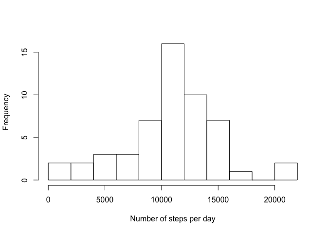
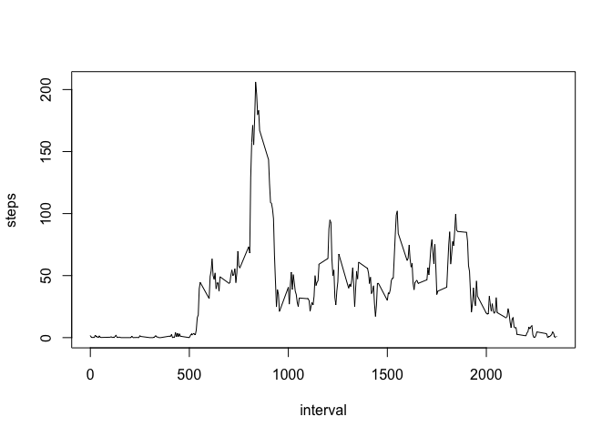
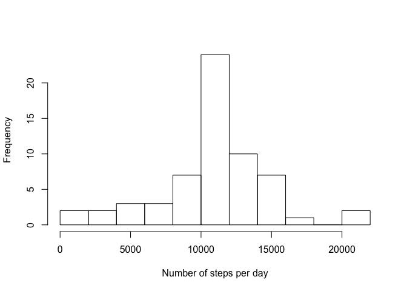
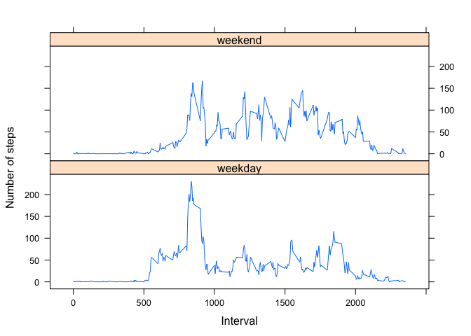

# ReproducibleResearch:PeerAssessment1
## Loading and preprocessing the data
Unzip and read data from csv.


```r
activity_data <- read.csv(unz("activity.zip", "activity.csv"))
head(activity_data)
```

```
##   steps       date interval
## 1    NA 2012-10-01        0
## 2    NA 2012-10-01        5
## 3    NA 2012-10-01       10
## 4    NA 2012-10-01       15
## 5    NA 2012-10-01       20
## 6    NA 2012-10-01       25
```

## What is mean total number of steps taken per day?
Use aggergate function to calculate steps per day:

```r
steps.date <- aggregate(steps ~ date, data=activity_data, FUN=sum)
```
Make a histogram:

```r
hist(steps.date$steps, main=" ", breaks=10, xlab="Number of steps per day")
```

 


Calculate mean total number of steps per day:

```r
mean_steps <- mean(steps.date$steps, rm.na=TRUE)
head(mean_steps)
```

```
## [1] 10766.19
```
and median:

```r
median_steps <- median(steps.date$steps)
head(median_steps)
```

```
## [1] 10765
```
## What is the average daily activity pattern?
Make a time-series plot of 5-minute interval and the average number of steps raken:

```r
steps_per_interval <- aggregate(steps ~ interval, data=activity_data, FUN=mean)
plot(steps_per_interval, type="l")
```

 

5-minute interval with maximum number of steps:

```r
max_interval <- steps_per_interval[
  steps_per_interval$steps==max(steps_per_interval$steps),]
max_interval
```

```
##     interval    steps
## 104      835 206.1698
```

## Imputing missing values

Calculate total number of rows with NAs:


```r
sum(is.na(activity_data))
```

```
## [1] 2304
```

Let's fill missing data with mean of 5-minutes interval.


```r
steps <- data.frame(activity_data$steps)
steps[is.na(steps), ] <- ceiling(tapply(X=activity_data$steps, 
                          INDEX=activity_data$interval, FUN=mean, na.rm=TRUE))

clean_data <- cbind(steps, activity_data[,2:3])
colnames(clean_data) <- c("steps", "date", "interval")
head(clean_data)
```

```
##   steps       date interval
## 1     2 2012-10-01        0
## 2     1 2012-10-01        5
## 3     1 2012-10-01       10
## 4     1 2012-10-01       15
## 5     1 2012-10-01       20
## 6     3 2012-10-01       25
```

Make a histogram of the total number of steps each day with new dataset:


```r
steps.date <- aggregate(steps ~ date, data=clean_data, FUN=sum)
hist(steps.date$steps, main=" ", breaks=10, xlab="Number of steps per day")
```

 


calculate the mean:

```r
step_mean <- mean(steps.date$steps)
step_mean
```

```
## [1] 10784.92
```

and the median:

```r
step_median <- median(steps.date$steps)
step_median
```

```
## [1] 10909
```


This values differ from values from row data. Both values increases when we replcing NAs with average value.

## Are there differences in activity patterns between weekdays and weekends?

Create a new factor variable with two levels: "weekday" and "weekend"


```r
daytype <- function(date){
  if (weekdays(as.Date(date)) %in% c("Sunday","Saturday"))
    { 
      daytype <- "weekend"
    }
  else
    {
      daytype <- "weekday"
    }
}
clean_data$daytype <- as.factor(sapply(clean_data$date, daytype))
head(clean_data)
```

```
##   steps       date interval daytype
## 1     2 2012-10-01        0 weekday
## 2     1 2012-10-01        5 weekday
## 3     1 2012-10-01       10 weekday
## 4     1 2012-10-01       15 weekday
## 5     1 2012-10-01       20 weekday
## 6     3 2012-10-01       25 weekday
```

```r
steps_by_interval_daytype <- aggregate(steps ~ interval+daytype, 
                                       data= clean_data, FUN=mean)
```

Make a panel plot:

```r
library(lattice)
xyplot(type="l", data=steps_by_interval_daytype, steps ~ interval | daytype, 
       xlab="Interval", ylab="Number of steps", layout=c(1,2))
```

 

